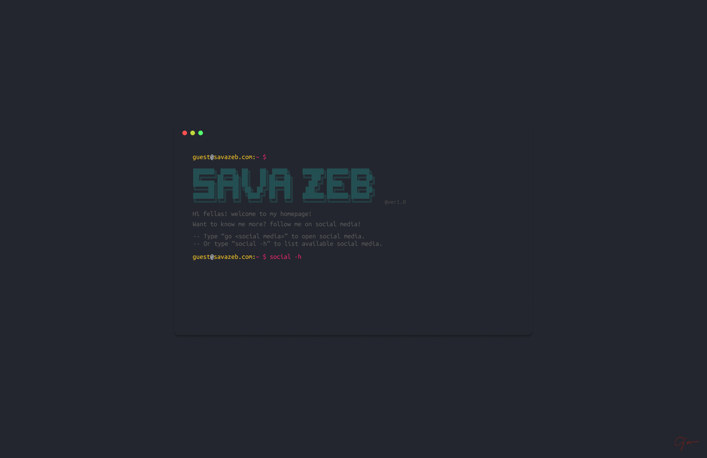

<div>
    
    
</div>

#  My HomePage

Terminal based GUI for my personal homepage. Check my [homepage](https://www.savazeb.com)!


## Requirements
1. Docker or npm  
   Needed to run the container
2. Bash shell (Optional)  
   Run the script files inside [./scripts](./scripts/)

## Tree
Source codes in this project are stored in [./src](./src/)
```bash
└── src
    └── app.js
```

## Basic Usage

For development you can use the provided shell script by running:
```bash
cd ./scripts && ./dev
```
Or, use npm manually by go to [./src](./src/), then
```bash
# install dependencies
npm install .

# start the developing server 
npm run dev
```
Check the server on [localhost:3000](http://localhost:3000)

## Deployment
Not Yet Supported

[MIT](./LICENSE)