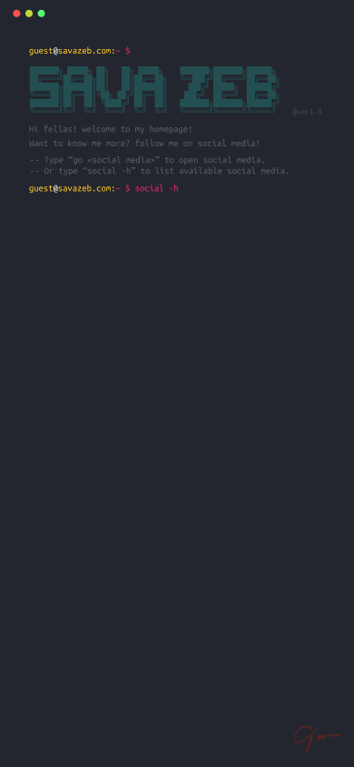

<div>
    
    
</div>

#  My HomePage

Terminal based GUI for my personal homepage. Check my [homepage](https://www.savazeb.com)!

## Basic Usage

```bash
# install dependencies
npm install .

# start the developing server
npm run dev
```
Check the server on [localhost:3000](http://localhost:3000)

[MIT](./LICENSE)
